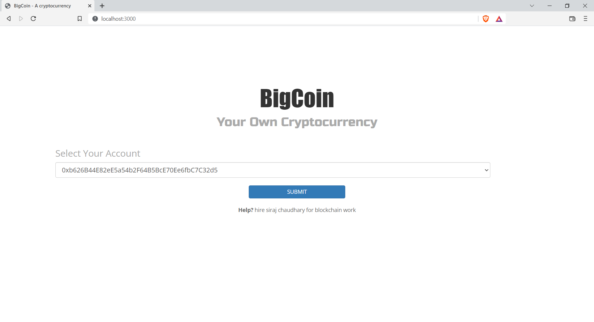
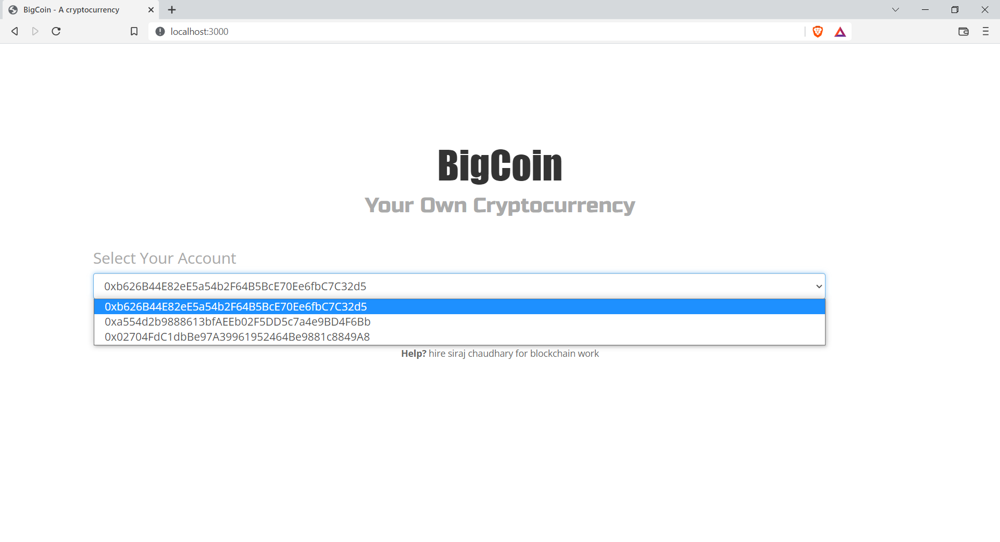
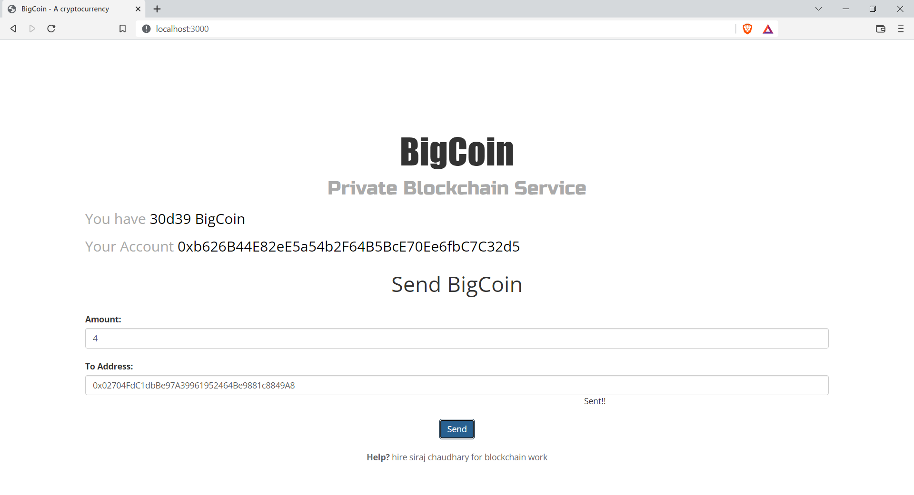
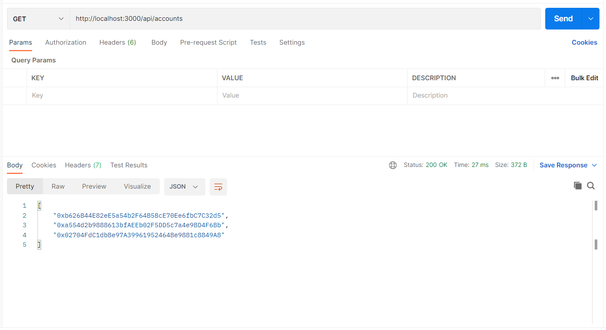
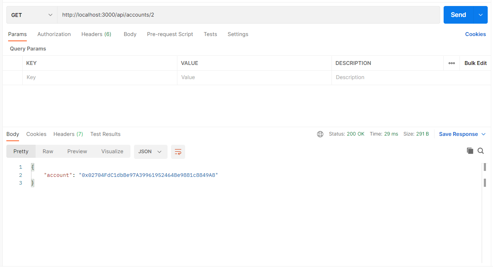
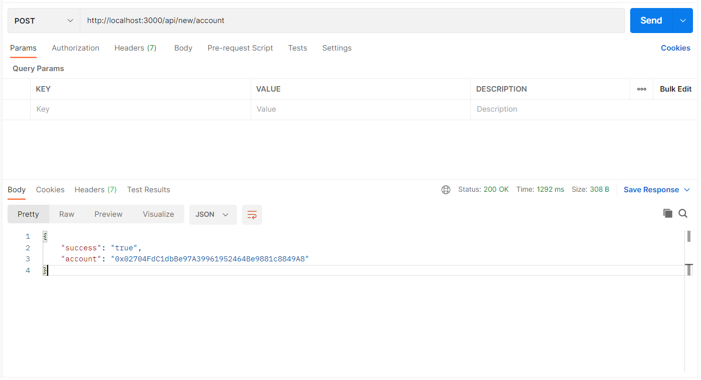
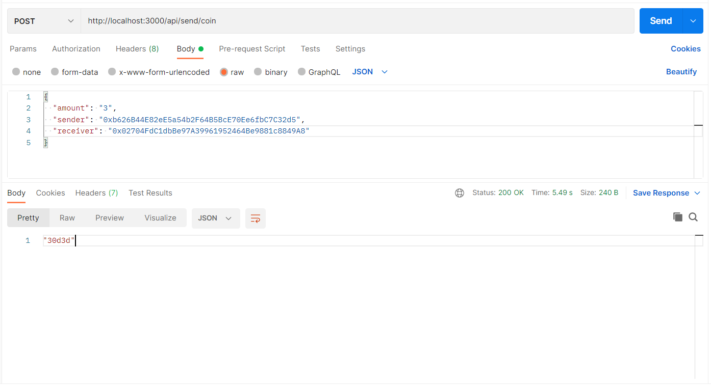
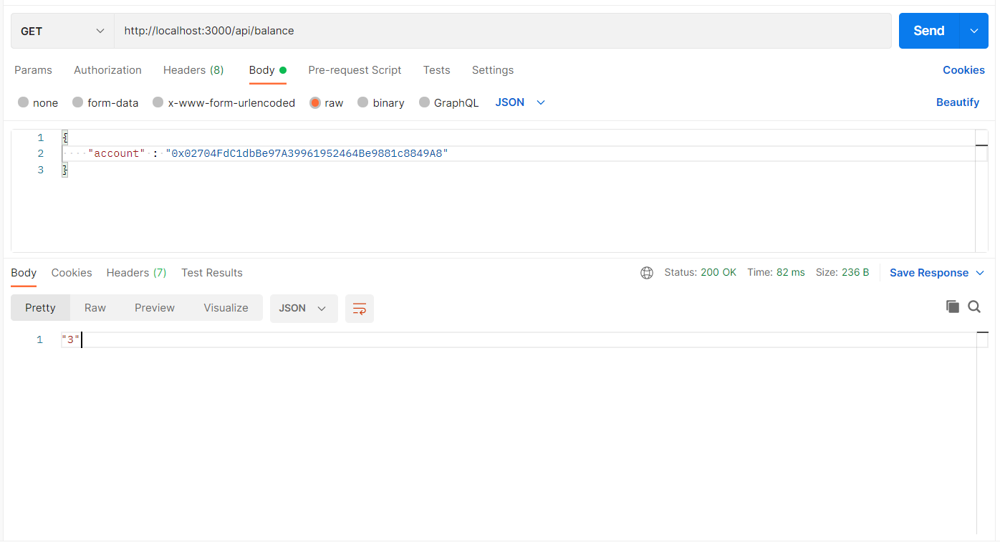

In this dapp we have created our own cryptocurrency named 'BigCoin' and deployed into our own private ethereum blockchain network.

## Salient Features
- This dapp is created using Truffle framework (under the hood it uses Web3).
- Used Truffle framework to create, complie & deploy smart contracts quickly.
- Used Web3 libraries to create REST endpoints (Web3 libraries allow you to interact with a ethereum node using HTTP, IPC or WebSocket)
- Created ERC20 based smart contracts using OpenZeppelin library.
- DID NOT use any Web3 provider such as MetaMask or Infura as we use our own full nodes (our own private blockchain network rather any public blockchain network)!

## HowTo run this dapp
Step1: Make sure [your ethereum blockchain network](https://github.com/SirajChaudhary/setup-a-private-ethereum-blockchain-multinodes-network) is up & running

Step2: Clone this project & install dependencies
> git clone https://github.com/SirajChaudhary/bigcoin-cryptocurrency-dapp.git

> npm install

Step3: Update the files (truffle-config.js, app/server.js files) by updating your blockchain bootstrap node URL, Port and blockchain networkId

Step4: Deploy smart contract (BigCoin.sol) into your blockchain network using following commands

You can delete /build folder and do fresh build with command 'truffle compile'
  > truffle compile

To run the test cases
  > truffle test

To deploy smart contracts to your blockchain network
  > truffle migrate

Step5: Start the express app (having REST endpoints and static web resources)
  > npm start

Step6: Done you can access dapp with URL http://localhost:3000/ or you can access REST endpoints via Postman

 

## DApp snapshots

 

## REST API Endpoints (via Postman)

1) API: /api/accounts  
Description: It fetch all accounts of the bootnode  
Method: GET  
RequestBody: None  

2) API: /api/accounts/:number  
Description: It fetch a account by number  
Method: GET  
RequestBody: account  

3) API: /api/new/account  
Description: It creates a new account  
Method: POST  
RequestBody: None  

4) API: /api/send/coin  
Description: It sends bigcoins from an account to another account  
Method: POST  
RequestBody: {
  "amount": "3",
  "sender": "0xb626B44E82eE5a54b2F64B5BcE70Ee6fbC7C32d5",
  "receiver": "0x02704FdC1dbBe97A39961952464Be9881c8849A8"
}  

5) API: /api/balance  
Description: It fetch an account balance  
Method: GET  
RequestBody: {
    "account" : "0x02704FdC1dbBe97A39961952464Be9881c8849A8"
}  

Note: Similarly you can create many REST endpoints for your smart contracts and JSON-RPC APIs as per your business needs !

#### [Wiki: Step-by-step instructions to create bigcoin-cryptocurrency-dapp from scratch](https://github.com/SirajChaudhary/bigcoin-cryptocurrency-dapp/wiki)

## License
Free Software, by [Siraj Chaudhary](https://www.linkedin.com/in/sirajchaudhary/) 
